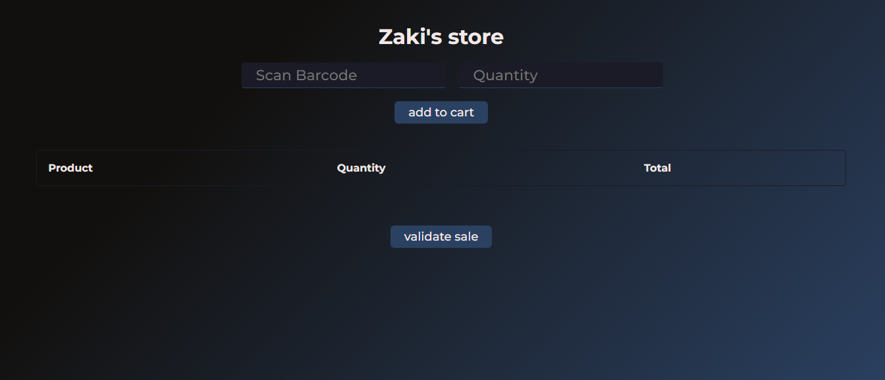
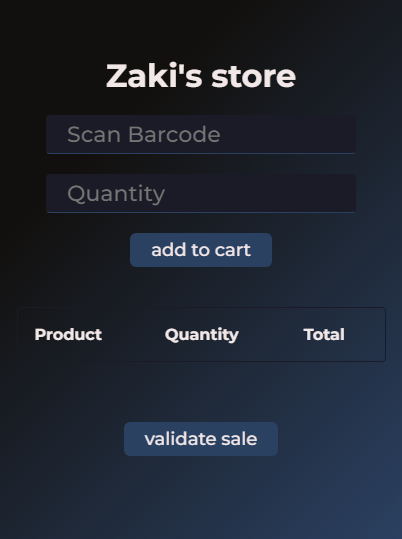
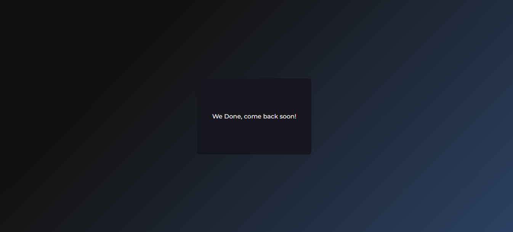
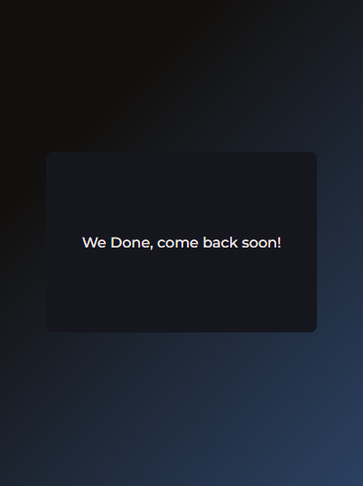
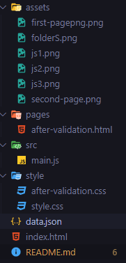
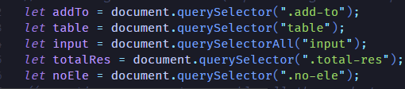
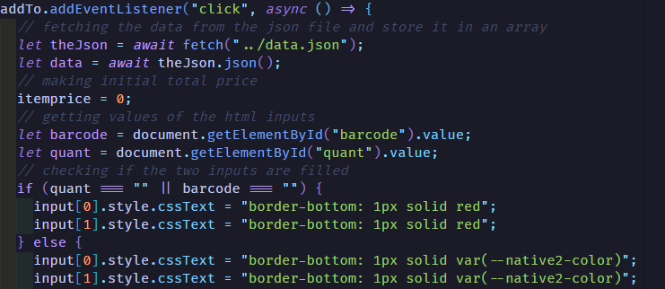
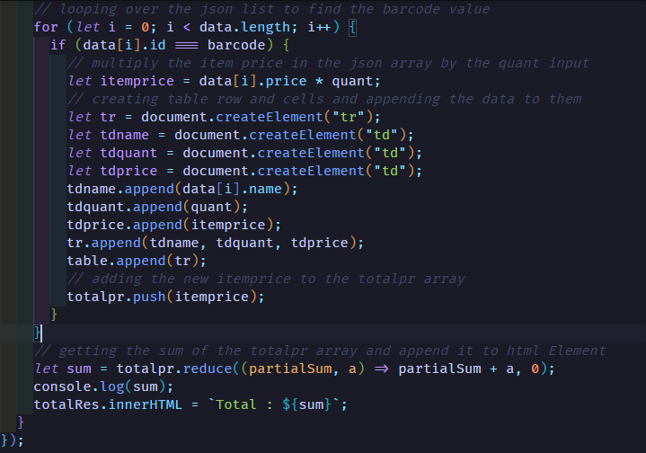

# Zaki's store

Heyy you're here i hope this readme
file meets your likes. lets dive in this documentation.

## Content

* Website overview
* Data
* Source Code
  * Folder Structure
    * assets
    * Pages
    * Src
    * Style
  * logic
    * JavaScript
    * Json
  * Other

## Website overview

here's the link to **Zaki's Store**

this is the first page of the **Zaki's store** (in both screens)

 

and after you fill the two inputs with proper info a, add to cart then validate the sale you'll get redirected to this page .

 

## Data

we only add six products in this web page here's every product with the bar code

|product|barcode|
|:-----:|:-----:|
|chess board|94891616|
|perfume for men|88855144|
|wireless speaker|55668998|
|phone case|98498988|
|keyboard XXL|44455611|
|monitor XL|111225547|
*if there is any error or you find this info wrong check the **data.json** file*

## Source Code

### Folder Structure

this is how the folder should look like

**all the files are well commented and organized**

* the assets folder contain the pictures we used in this README file.
* the pages folder contains the second html script .
* the src folder contains the JavaScript files (and there's all the website logic) .
* css folder with css files of the first and the second html pages .
* **index.html** file is the first page html script
* **data.json** file stores the products data like **id**,**name**...

### Logic (JavaScript and JSON)

so how this website actually works ? lemme explain..
at first we implement the [DOM](https://www.w3.org/TR/WD-DOM/introduction.html) Concept to gather the elements that needs interacting with each other .

creating an array to store all the prices that comes from the input proccesing.
now we make to an [event listener](https://blog.webdevsimplified.com/2022-01/event-listeners/#:~:text=An%20event%20listener%20in%20JavaScript,click%20events%20on%20a%20button.) with function that calls fetch the data from a [JSON](https://www.w3schools.com/whatis/whatis_json.asp) (data.json) and store it in array and after getting the input values and checking if are they correct and well filled .

we loop over the json array to find the input that the user gives if it
founds it we take the price value from the list and multiply it by the second user input and store it in a var ,then we store that element values in td elements we create (DOM)
we push that price var to that array (stores prices) than we use the a [higher order function](https://www.codecademy.com/learn/game-dev-learn-javascript-higher-order-functions-and-iterators/modules/game-dev-learn-javascript-iterators/cheatsheet) (reduce) to get sum of all the prices then show it on the web page

### other

here's some features :

* **this website is  dynamic you can add new products just by acessing jSON file**
* **we made sure that Zaki's Store is responsive with a well design**
* **we kept in mind the error handling and we made sure  to make the user expreience easier without any unexpected bugs or errors**
